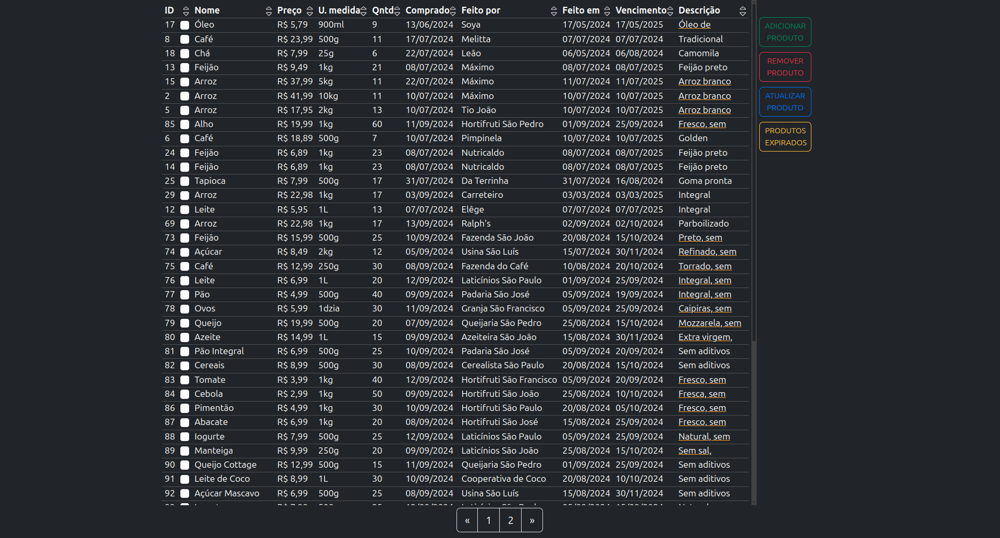

# Grocery Web Manager

Grocery Web Manager é um aplicativo HTML projetado para gerenciar seus produtos de supermercado de forma eficiente. Ele fornece uma interface simples e intuitiva para armazenar e rastrear informações sobre seus produtos.

[Demo](https://grocerywm.vercel.app/ "Grocery Web Manager")

